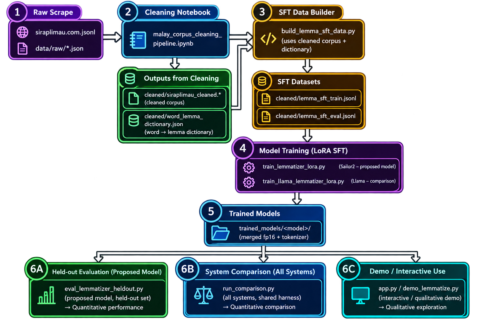

# Malay–English "Rojak" Lemmatiser

Fine-tunes a small chat LLM (**Sailor2-3B-Chat**, via LoRA) to lemmatise code-mixed
Malay–English ("rojak") text at the sentence level, and benchmarks it against rule-based and
neural stemmer baselines.

Given a sentence, the model returns a JSON list of `{surface, lemma}` objects — expanding
Malay affixes and slang (`berkongsilah → kongsi`, `nak → hendak`) while leaving English root
words and punctuation untouched.

```
"Korang nak pinjam kete aku ke petang ni?"
→ [{"surface":"Korang","lemma":"korang"}, {"surface":"nak","lemma":"hendak"},
   {"surface":"pinjam","lemma":"pinjam"}, {"surface":"kete","lemma":"kereta"}, ...]
```

---

## Pipeline



### 1. Corpus cleaning — `src/malay_corpus_cleaning_pipeline.ipynb`

Takes the raw scraped forum dump (`data/raw/siraplimau.com.jsonl`) and produces a clean, sentence-segmented corpus plus a word→lemma reference dictionary.

Pipeline stages:
1. **Load data** (`data/raw/siraplimau.com.jsonl`): Reads the raw scraped corpus, one JSON object per article.
2. **Structural / boilerplate cleanup**: Removes site-specific junk — TikTok footers, CMS tag lines, tweet/Facebook embeds, image-carousel widgets.
3. **Language / content filtering**: Keeps only valid Malay/Indonesian text; drops near-empty, duplicate, or foreign-script pages.
4. **Normalization**: Unicode NFC, whitespace collapsing, punctuation handling, cased + lowercased variants per document.
5. **Sentence & word tokenization**: Uses Malaya's tokenizer if available, regex fallback otherwise.
6. **Slang / short-form normalization** *(5b)*: Maps casual short forms to standard Malay using curated rojak mappings (`data/raw/BM_dict.csv`). A CSV of auto-detected candidates (`data/processed/short_form_candidates.csv`) can be filled manually and re-applied.
7. **Stopword removal** *(optional)*: Built as a side artifact; off by default since the output feeds embeddings/LLMs, not BoW models.
8. **Lemmatization**: Via `malaya.stem.sastrawi()` — fast rule/dictionary-based, CPU-only.
9. **Assemble & save**: Writes `data/processed/siraplimau_cleaned.jsonl` (one row per doc with sentence/token/lemma arrays) and `data/processed/word_lemma_dictionary.json` (every unique `token → lemma` pair seen in the corpus — the gold reference used to build training data).

| Output | Contents |
|---|---|
| `data/processed/siraplimau_cleaned.jsonl` / `.parquet` | cleaned corpus, one row per document with a `sentences` list |
| `data/processed/word_lemma_dictionary.json` | word → lemma (identity fallback, overlaid with curated mappings) — the gold reference |
| `data/processed/short_form_candidates.csv`, `manual_tagging_template.csv`, `manual_tags.json` | manual slang-tagging workflow artefacts |

### 2. Build training data — `build_lemma_sft_data.py`

Turns cleaned sentences + the word→lemma dict (+ `BM_dict.csv` overrides) into
`{"sentence", "target": [{"surface","lemma"}, ...]}` rows. Split **by document** so
near-duplicate sentences from one article can't leak across train/eval. Sentences containing
a curated slang word are prioritised so slang coverage survives subsampling.

| Output | Contents |
|---|---|
| `cleaned/lemma_sft_train.jsonl` | ~12,000 sentences |
| `cleaned/lemma_sft_eval.jsonl` | ~1,500 held-out sentences (documents excluded from training) |

Run:
```
python build_lemma_sft_data.py
```

### 3. Fine-tune

| Script | Base model | Output |
|---|---|---|
| `train_lemmatizer_lora.py` | `sail/Sailor2-3B-Chat` | `trained_models/sailor2_malay_lemmatizer/` (merged) + `..._lora_adapter/` |
| `train_llama_lemmatizer_lora.py` | `mesolitica/Malaysian-Llama-3.2-3B-Instruct` | `trained_models/llama_malay_lemmatizer/` (merged) + `..._lora_adapter/` |

Both use the **same** data, prompt format, LoRA config (r=16, α=32), and schedule (2 epochs,
lr 1e-4) — the Llama script imports its dataset/hyperparams from the Sailor2 script — so the
two fine-tuned LLMs are compared under identical conditions. LoRA weights are trained fp16
with the base frozen, loss masked to the assistant JSON response, then merged into a
standalone fp16 checkpoint.

```
python train_lemmatizer_lora.py            # ~progress + loss to stdout, checkpoints every 200 steps
python train_llama_lemmatizer_lora.py
```

`trained_models/` is **git-ignored** (large weights). Each merged dir also gets a
`metadata.json` describing how it was trained.

### 4. Evaluate & compare

**`run_comparison.py`** — the section 3.1.4 comparison table, and the single entry point for
evaluation. All systems, one shared held-out sample, one alignment routine, one metric set
(`eval_harness.py`), scored against the gold `{surface, lemma}` targets in
`cleaned/lemma_sft_eval.jsonl`:

| System key | What it is |
|---|---|
| `identity` | lower bound: lemma = surface |
| `malaya_naive` | `malaya.stem.naive()` reimplemented in pure Python — regex prefix/suffix stripping, no dictionary check (over-stems: `menarik → arik`). The paper's "Naive Stemmer from the Malaya library". |
| `sastrawi` | `malaya.stem.sastrawi()` reimplemented — PySastrawi confix-stripping + lemmatisation, behind Malaya's pass-through/casing wrapper. Conservative. |
| `stem_lstm_512` | `mesolitica/stem-lstm-512` char-LSTM seq2seq stemmer, loaded via `malaya.stem.huggingface()` (needs torch). `stem_gru_bahdanau_1024` also available. |
| `sailor2` | **proposed** fine-tuned Sailor2 |
| `llama` | fine-tuned Malaysian-Llama (comparison LLM) |

The two rule-based baselines are **faithful reimplementations** of Malaya's `Naive` /
`Sastrawi` classes (affix tables `malaya.text.tatabahasa.permulaan` / `hujung`, algorithm
from `malaya.model.stem`), verified byte-for-byte against the installed Malaya — so they run
without importing `malaya`/torch. English-word pass-through uses
`malaya.dictionary.ENGLISH_WORDS` when importable, and is skipped otherwise (documented
degraded mode).

Rule-based / seq2seq baselines are fed the **gold surface tokens** so tokenisation is
identical and only stem quality is measured; the LLMs generate their own token list and the
harness aligns whatever they return.

```
python run_comparison.py                                  # every system the env supports, n=200, seed=7
python run_comparison.py --systems identity,sastrawi      # subset
python run_comparison.py --systems sailor2,llama --n 300  # the two fine-tuned LLMs, larger sample
```

A system whose dependency or checkpoint is missing is **skipped with a printed reason**, not
a crash.

### 5. Try it

```
.venv-1/Scripts/streamlit run app.py     # web UI, loads trained_models/sailor2_malay_lemmatizer
python demo_lemmatizer.py                 # runs the model on fresh hand-written sentences, prints only
```

---

## Where results are printed / stored

| Producer | Printed to stdout | Written to disk |
|---|---|---|
| `build_lemma_sft_data.py` | train/eval counts, one sample row | `cleaned/lemma_sft_train.jsonl`, `cleaned/lemma_sft_eval.jsonl` |
| `train_lemmatizer_lora.py` | per-10-step loss, lr, elapsed; merge progress | `trained_models/sailor2_malay_lemmatizer/` (+ `metadata.json`), `..._lora_adapter/`, `lora_checkpoint_partial/`. Redirect stdout to keep a log (e.g. `train_run.log`). |
| `train_llama_lemmatizer_lora.py` | same | `trained_models/llama_malay_lemmatizer/` (+ `metadata.json`), `..._lora_adapter/`, `llama_lora_checkpoint_partial/` |
| `run_comparison.py` | per-system metric line during the run, then the full **comparison table** and a metric legend; lists any skipped systems | **`comparison_results.json`** — `meta` (sample size, seed, skipped), `results` (per-system metric dict), `examples` (first 8 aligned sentences per system). Path overridable with `--out`. |
| `test_lemmatizer.py` | word-level agreement with the gold dictionary on 5 test sentences | `test_lemmatizer_results.json` |
| `demo_lemmatizer.py` | model output per sentence + timing | *(nothing — stdout only)* |

### Metrics in `comparison_results.json` / the table

| Column | Meaning |
|---|---|
| `token_accuracy` (TokAcc) | exact lemma match over **all** gold tokens; dropped/unparseable tokens count as wrong |
| `lemma_accuracy` (LemAcc) | exact lemma match over only the **gold-transformed** tokens (lemma ≠ surface) — not inflated by punctuation / already-root words |
| `precision` / `recall` / `f1` | lemmatisation as detect-and-correct over transformed tokens: TP = system changed the token *and* produced the right lemma; FP = changed it wrongly; FN = should have changed it but didn't |
| `coverage` (Cov) | fraction of gold tokens the system produced an aligned prediction for (1.0 for baselines, <1.0 when an LLM drops/merges tokens) |
| `unparseable_rate` (Unparse) | fraction of sentences whose model output couldn't be parsed to a `{surface, lemma}` list (0.0 for baselines) |

Latest indicative numbers (`--n 200` for rule-based, `--n 12` for LLM, seed 7):

| System | TokAcc | LemAcc | Prec | Rec | F1 |
|---|---|---|---|---|---|
| identity | 0.785 | 0.000 | 0.000 | 0.000 | 0.000 |
| malaya_naive | 0.792 | 0.565 | 0.442 | 0.692 | 0.539 |
| sastrawi | 0.956 | 0.794 | 1.000 | 0.794 | 0.885 |
| stem_lstm_512 | 0.923 | 0.692 | 0.871 | 0.750 | 0.806 |
| **sailor2_ft** | 0.811 | **0.872** | **0.971** | **0.895** | **0.932** |
| llama_ft | *(train `train_llama_lemmatizer_lora.py` first)* | | | | |

(Sailor2's lower TokAcc / coverage here is the small-`n` sample plus its ~8% unparseable
rate; run the full `--n 300` for the reportable figure.)

Re-run `python run_comparison.py --n 300` for the reportable table once the Llama checkpoint
exists.

---

## Environment

```
.venv-1/           # Python 3.11 virtualenv (git-ignored). transformers, torch, peft,
                   # accelerate, malaya, PySastrawi, streamlit.
```

GPU (bf16) is expected for training and for the LLM eval systems; the rule-based baselines
(`identity`, `sastrawi`) run on CPU with no torch. On an RTX 50-series card PyTorch must be a
CUDA 12.8+ build (`sm_120`) or the LLM paths fail to load.

## Layout

| Path | |
|---|---|
| `malay_corpus_cleaning_pipeline.ipynb` | corpus cleaning (step 1) |
| `build_lemma_sft_data.py` | SFT data builder (step 2) |
| `train_lemmatizer_lora.py` / `train_llama_lemmatizer_lora.py` | fine-tuning (step 3) |
| `eval_harness.py` | shared sampling + alignment + metrics |
| `lemmatizer_systems.py` | all systems behind one `predict_batch` interface |
| `run_comparison.py` | comparison-table entry point (all-systems evaluation) |
| `test_lemmatizer.py` / `demo_lemmatizer.py` | qualitative checks |
| `app.py` | Streamlit UI |
| `BM_dict.csv` | curated rojak-slang → standard-Malay mappings |
| `cleaned/` | cleaned corpus, dictionary, SFT splits |
| `data/raw/` | external Malaya/Malaysia-AI stemmer datasets |
| `trained_models/` | merged checkpoints + LoRA adapters (git-ignored) |
| `results/` | evaluation outputs and run logs — generated by the scripts above; re-run `run_comparison.py` / `train_*.py` to regenerate |
